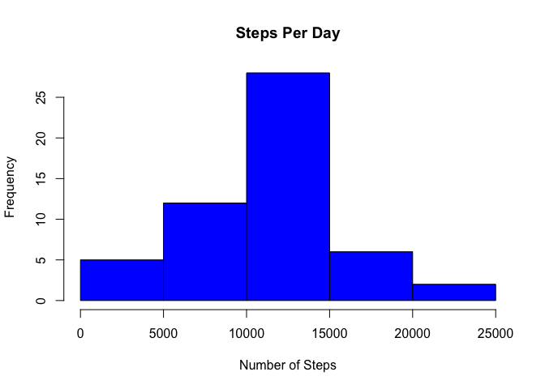
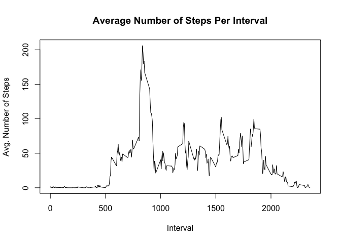
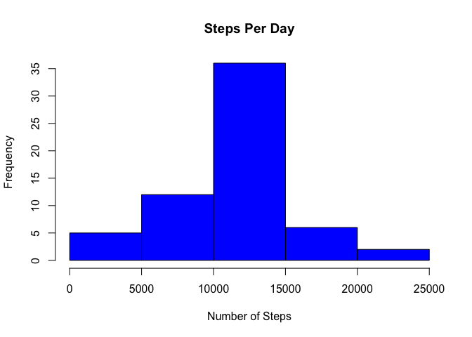
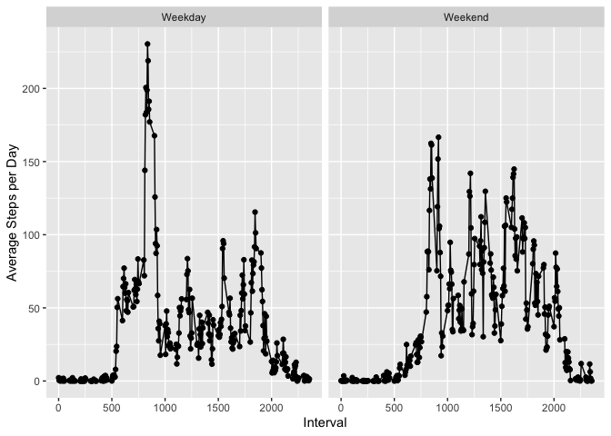

```r
knitr::opts_chunk$set(echo = TRUE)
```

## Overview

This analysis is intended to provide an overview of personal movement using activity monitoring devices such as Fitbit. The focus is on gaining a better understanding of steps taken throughout the day.

The data were collected during the months of October and November 2012 and includes the number of steps taken in 5 minute intervals each day.

## Loading and preprocessing the data

Load the data set into a table so that analysis can be performed.


```r
# Load the dplyr package used to summarize the data
library(dplyr)
```

```
## 
## Attaching package: 'dplyr'
```

```
## The following objects are masked from 'package:stats':
## 
##     filter, lag
```

```
## The following objects are masked from 'package:base':
## 
##     intersect, setdiff, setequal, union
```

```r
# Load the ggplot2 package used to graph the data
library(ggplot2)

# Read the csv data and store it as a tables
activityTable <- read.csv("activity.csv")
activityTableDF <- as_tibble(activityTable)
activityWithoutNulls <- activityTable[!is.na(activityTable$steps),]
activityWithoutNullsDF <- as_tibble(activityWithoutNulls)

# Total the steps by date
days <- group_by(activityWithoutNullsDF, date)
stepsByDaySummary <- summarise(days, steps = sum(steps))
```

```
## `summarise()` ungrouping output (override with `.groups` argument)
```

```r
# Get the mean and median steps per day
meanStepsTaken <- as.character(round(mean(stepsByDaySummary$steps),1))
medianStepsTaken <- as.character(round(median(stepsByDaySummary$steps),1))

# Get the average number of steps per interval
intervals <- group_by(activityWithoutNullsDF, interval)
intervalSummary <- summarise(intervals, steps = sum(steps), numOfDays = n_distinct(date))
```

```
## `summarise()` ungrouping output (override with `.groups` argument)
```

```r
intervalSummary$avgSteps <- intervalSummary$steps / intervalSummary$numOfDays

# Get the interval with the highest average number of steps
invervalWithMaxStepsOnAverage <- intervalSummary[intervalSummary$avgSteps == max(intervalSummary$avgSteps),]$interval

# Get the number of records with null steps recorded
numberOfRecordsWithNoData <- sum(is.na(activityTable$steps))

# Default the steps with missing values substituted to the steps

# Join the data with nulls to the interval summary based on the summary by interval
activityTableWithIntervalAvgsDF <- left_join(activityTableDF, intervalSummary, by = "interval")
# Add a column to store the number of steps with the substituted value for nulls
activityTableWithIntervalAvgsDF$stepsNullsSubstituted <- activityTableWithIntervalAvgsDF$steps.x
# Get the rows with nulls
index <- is.na(activityTableWithIntervalAvgsDF$stepsNullsSubstituted)
# Set the nulls to the average for that interval
activityTableWithIntervalAvgsDF$stepsNullsSubstituted[index] <- activityTableWithIntervalAvgsDF$avgSteps
```

```
## Warning in activityTableWithIntervalAvgsDF$stepsNullsSubstituted[index] <-
## activityTableWithIntervalAvgsDF$avgSteps: number of items to replace is not a
## multiple of replacement length
```

```r
# Add a field to determine if the day is a weekday or weekend
activityTableWithIntervalAvgsDF$dayOfWeek <- weekdays(as.Date(activityTableWithIntervalAvgsDF$date))
activityTableWithIntervalAvgsDF$dayType <- "Weekday"
activityTableWeekendIndex <- activityTableWithIntervalAvgsDF$dayOfWeek == "Saturday" | activityTableWithIntervalAvgsDF$dayOfWeek == "Sunday"
activityTableWithIntervalAvgsDF$dayType[activityTableWeekendIndex] <- "Weekend"

# Add weekend summary
summaryByDayType <- activityTableWithIntervalAvgsDF %>% group_by(dayType, interval) %>% summarize(avgStepsPerDayType = mean(stepsNullsSubstituted, na.rm=TRUE))
```

```
## `summarise()` regrouping output by 'dayType' (override with `.groups` argument)
```

```r
# Make an equivalent table with the subsitute value
newActivityTable <- select(activityTableWithIntervalAvgsDF, stepsNullsSubstituted, date, interval)
newActivityTableDF <- as_tibble(newActivityTable)

# Total the steps by date
newDays <- group_by(newActivityTableDF, date)
newStepsByDaySummary <- summarise(newDays, steps=sum(stepsNullsSubstituted))
```

```
## `summarise()` ungrouping output (override with `.groups` argument)
```

```r
# Get the mean and median steps per day
newMeanStepsTaken <- as.character(round(mean(newStepsByDaySummary$steps),1))
newMedianStepsTaken <- as.character(round(median(newStepsByDaySummary$steps),1))
```

## What is mean total number of steps taken per day?


```r
# Display a histogram of the number of steps per day
hist(stepsByDaySummary$steps,main="Steps Per Day",xlab="Number of Steps",col="blue")
```

<!-- -->

The mean number of steps per day was 10766.2 while the median was 10765.

## What is the average daily activity pattern?


```r
# Display a line chart of the average number of steps per interval
plot(intervalSummary$interval, intervalSummary$avgSteps, type="l", xlab="Interval", ylab="Avg. Number of Steps", main="Average Number of Steps Per Interval")
```

<!-- -->

The interval with the highest average steps is 835.

## Imputing missing values

The data set contains 2304 missing values.


```r
# Display a histogram of the number of steps per day
hist(newStepsByDaySummary$steps,main="Steps Per Day",xlab="Number of Steps",col="blue")
```

<!-- -->

The mean number of steps per day was 10766.2 while the median was 10766.2.

There is not a major difference with the imputed values. The median is now equal to the mean.

## Are there differences in activity patterns between weekdays and weekends?


```r
ggplot(data=summaryByDayType, aes(x=interval, y=avgStepsPerDayType, group=1)) + geom_line() + geom_point() + facet_wrap(~ dayType) + labs(y="Average Steps per Day", x="Interval")
```

<!-- -->

Weeday mornings tend to have more activity than weekend mornings while mid-day activity is higher on the weekends.
